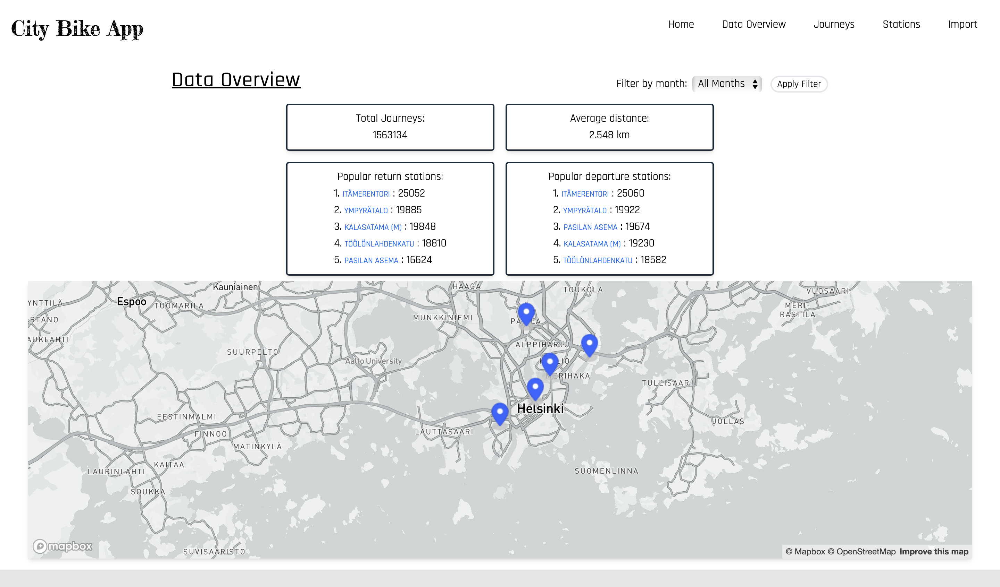
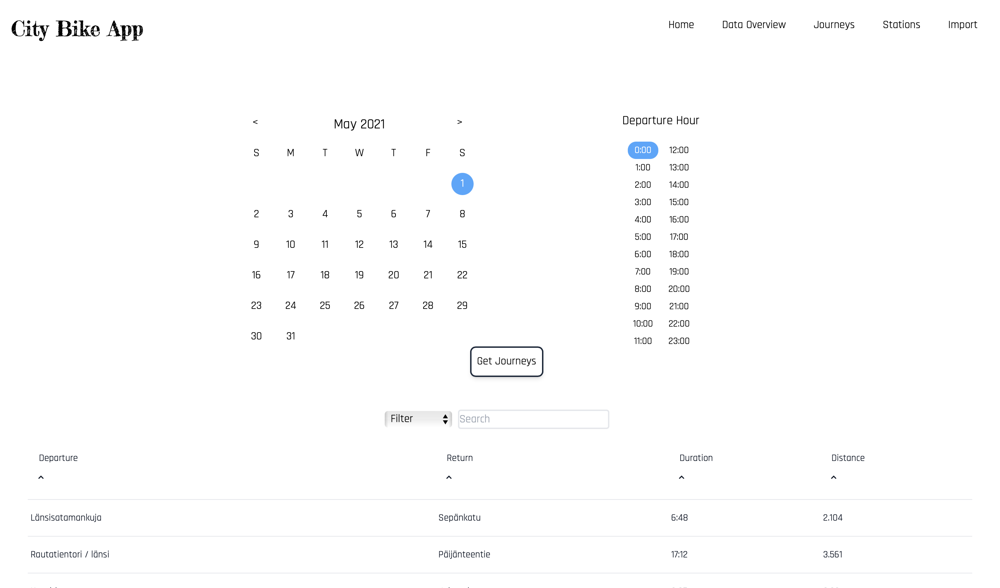
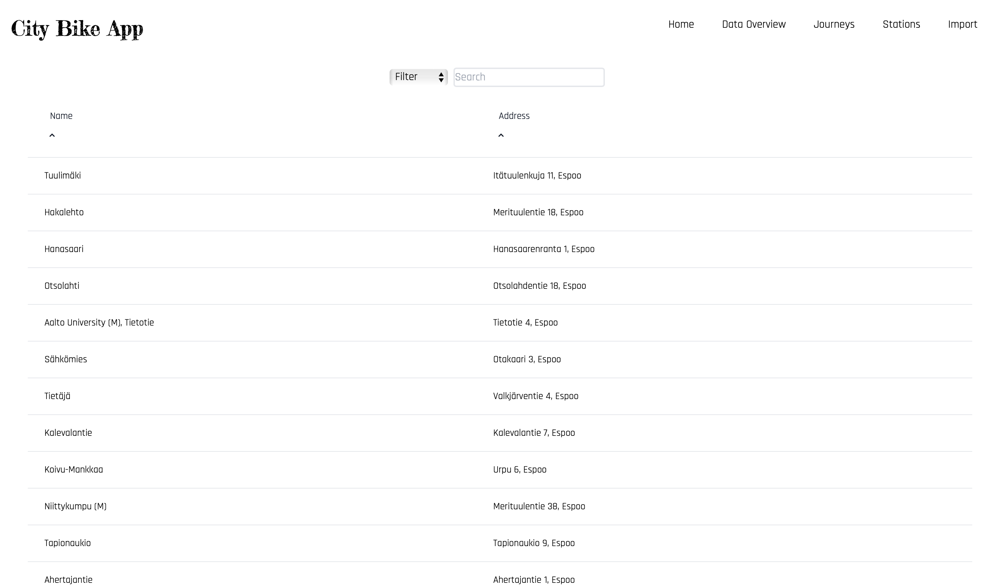
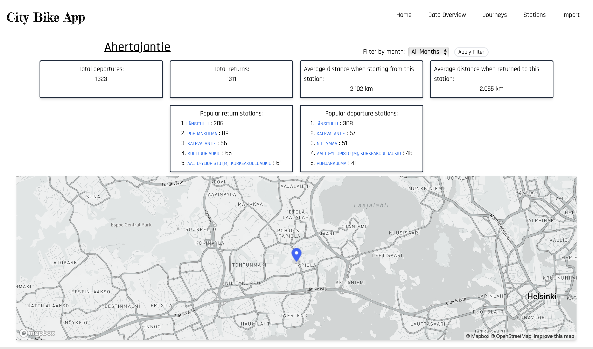
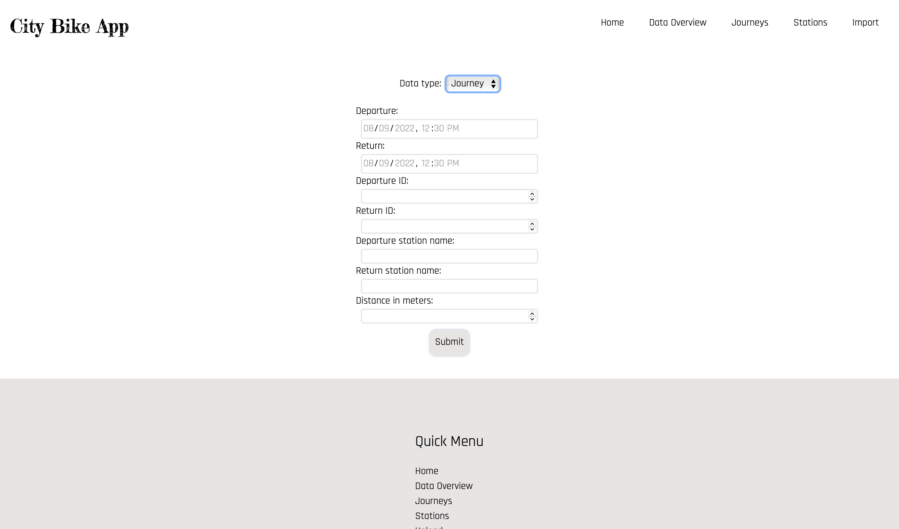

# Solita Dev Academy Finland fall 2022 pre-assignment

## Project Overview
This is a full stack React and NodeJS data exploration website which enables the user to examine  HSL's city bike station and journey data from May to July 2021.

Front end:
- React
- Axios
- React Router
- Mapbox GL

Back end:
- NodeJS
- Express
- Mongoose 

Database: 
- MongoDB (Atlas)

---

## Live Site
[https://sda-fall22.pages.dev](https://sda-fall22.pages.dev)

---
### Want to run it locally? 
Please navigate to the [front-end](https://github.com/andrewdelamare/SDA-Fall22/tree/master/front-end) and [back-end](https://github.com/andrewdelamare/SDA-Fall22/tree/master/back-end) directories for complete instructions 

---
### Completed features: 

#### Data import:
- Import data from CSV files to database
- Validate data before importing
- Don't import journeys that lasted for less than ten seconds
- Don't import journeys that covered distances shorter than 10 meters
- Don't import duplicates 

Journey list view:

- List journeys
- Date selection
- Hour selection
- Pagination
- Filtering 
- Searching 
- Ordering per column
- For each journey show departure and return stations, covered distance in kilometers and duration in minutes
- For each journey departure and return stations are clickable links 

Station list:
- List all the stations
- Pagination
- Searching
- Filtering 

Single station view:
- Station name
- Station address
- Total number of journeys starting from the station
- Total number of journeys ending at the station
- Station location on the map
- Average distance of a journey starting from the station
- Average distance of a journey ending at the station
- Top 5 most popular return stations for journeys starting from the station
- Top 5 most popular departure stations for journeys ending at the station
- Ability to filter all the calculations per month

Data view:
- Total number of journeys stored in database
- Average distance of journeys stored in database
- Top 5 most popular return stations for journeys
- Top 5 most popular departure stations for journeys
- Ability to filter all the calculations per month
- Locations of top 5 popular departure and return stations on the map

Import view:
- Endpoints to store new journeys data or new bicycle stations
- UI for station input
- UI for journey input
- Form validation with react-hook-form

Deployment: 
- Deployment of back-end with heroku
- Deployment of front end with cloudflare

Tests:
- Back end tests with jest
- Basic front end render tests with jest

Documentation:
- Front end docs
- Parser docs
- Back end docs

***
