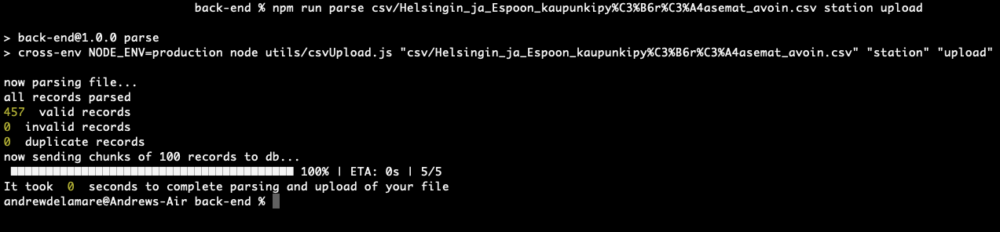

# City Bike App Back-End

This back end requires a connection to a MongoDB (document based) database. This can be set up locally or through one of the many cloud based options available.

Directions for local database setup can be found [here](https://www.mongodb.com/docs/manual/administration/install-community/) and for my reccomended cloud setup (MongoDB Atlas) [here](https://www.mongodb.com/docs/atlas/getting-started/?_ga=2.11649268.1107999805.1660037563-238546531.1659686453).

## Steps to run the back-end locally

### Setup:

1. Clone [SDA-Fall22](https://github.com/andrewdelamare/SDA-Fall22)

2. Switch to the back-end directory & run:

   #### `npm install`

3. Create .env file and assign values to:

   (the port you want to run the server on)

   ```
   PORT=3003
   ```

   (the url of your main mongodb cluster)

   ```
   MONGODB_URI="mongodb://[username:password@]host1[:port1][,...hostN[:portN]][/[defaultauthdb][?options]]"
   ```

   (the url of your mongodb cluster for testing)

   ```
   TEST_URI="mongodb://[username:password@]host1[:port1][,...hostN[:portN]][/[defaultauthdb][?options]]"
   ```

### Start:

`npm start`

### Test:

`npm test`

---

# CSV Parser

## What is it?

It is a set of functions which parse, validate, filter and upload csv files. These are packaged and can be run together in sequence from the command line with a script or run independantly (for testing). The script accepts three arguments: `file`, `type` & `action`.
With these arguments it parses the provided file, creates documents based on the schema of the type, and either uploads the file to your database or returns the ammount of time it took to complete all the operations.

## How to run it:

In the back-end directory run:

```
npm run parse (fileLocation) (fileType) upload
```

File types:

1. trip (as seen here: [HSL Trip Data](https://dev.hsl.fi/citybikes/od-trips-2021/2021-05.csv) - owned by City Bike Finland)
2. station (as seen here: [HSL City Bike Stations](https://www.avoindata.fi/data/en_GB/dataset/hsl-n-kaupunkipyoraasemat/resource/a23eef3a-cc40-4608-8aa2-c730d17e8902))

Example:

```
npm run parse csv/2021-05.csv trip upload
```


